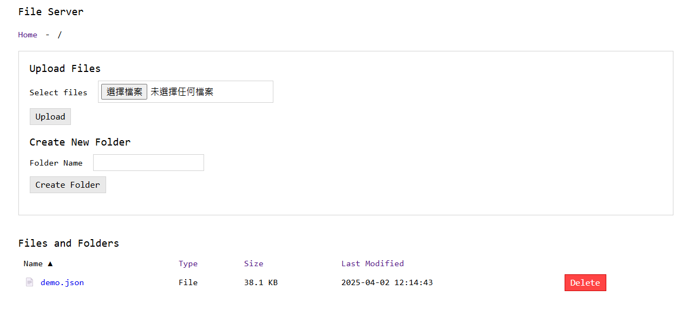

# Simple HTTP Server with File Upload/Download 🚀

A lightweight HTTP server based on Python's standard library that provides directory browsing, file download, and file upload capabilities. By default, the server serves and allows uploads to the `./data/` directory. However, users can customize the directory by mounting it using Docker or providing the directory when using the `python main.py` command.



## Features

- File upload and download functionality 🔄
- Multiple file upload capability 🚚
- Folder creation 📂
- Sortable columns (by name, type, size, last modified) 🔄
- Clean, responsive user interface 🎨
- No external dependencies - uses only Python standard library 🐍

## Requirements

- Python 3.9 or higher 🐍

## Usage

```bash
python main.py [-H HOST] [-p PORT] [DIRECTORY]
```

### Arguments

- `-H`, `--host` (optional): Host address to bind to (default: 0.0.0.0) 🌐
- `-p`, `--port` (optional): Port number to listen on (default: 8000) 🚀
- `DIRECTORY` (optional): Base directory (default: current directory) 📂

Note: Regardless of the base directory specified, the server will only serve and allow uploads to the specified directory.

### Examples

Start server on default host and port serving the current directory's data folder:
```bash
python main.py
```

Start server on a specific port:
```bash
python main.py -p 8000
```

Start server on a specific host and port:
```bash
python main.py -H 0.0.0.0 -p 8000
```

Start server with a specific base directory:
```bash
python main.py /path/to/directory
```
This will serve files from the specified directory

Start server with all options:
```bash
python main.py -H 0.0.0.0 -p 8000 /path/to/directory
```

## Project Structure

```
simple-http-server/
├── server/
│   ├── __init__.py
│   ├── handler.py        # HTTP request handler
│   ├── template_loader.py # Template loading and rendering
│   └── path_utils.py     # Path utilities
├── templates/            # HTML templates
│   └── directory.html    # Directory listing template
├── static/               # Static files
│   ├── style.css         # CSS styles
│   └── script.js         # JavaScript
├── data/                 # User files (created automatically)
├── main.py               # Main entry point
└── README.md             # Documentation
```

## Security Considerations

It is not intended for production use or exposure to the public internet. Use it only in trusted environments. 🚫

## License

This project is open source and available under the MIT License. 📜

## Docker Support

The server can be run in a Docker container for easier deployment and isolation.

### Using Docker Directly

Build the Docker image:
```bash
docker build -t simple-http-server .
```

Run the container:
```bash
docker run -p 8000:8000 -v ./data:/data simple-http-server
```

With custom host and port:
```bash
docker run -p 8000:8000 -v ./data:/data simple-http-server -H 0.0.0.0 -p 8000
```

### Using Docker Compose

Start the server with default settings:
```bash
docker compose up -d
```

Start the server with a custom port:
```bash
PORT=9000 docker compose up -d
```

Stop the server:
```bash
docker compose down
```

### Docker Volumes

The Docker configuration mounts the specified directory by default to the container, which contains all uploaded files and is persisted.

This allows you to customize the appearance and behavior of the server without rebuilding the Docker image. 🔄

